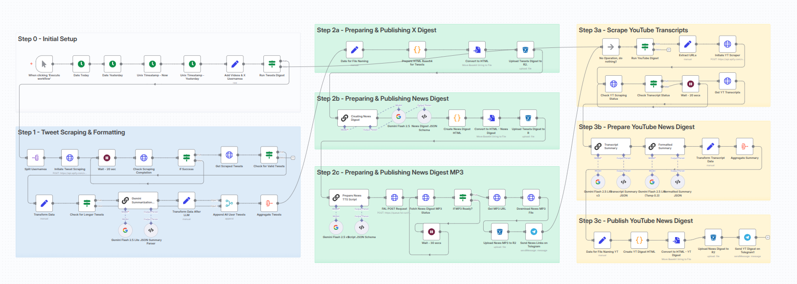
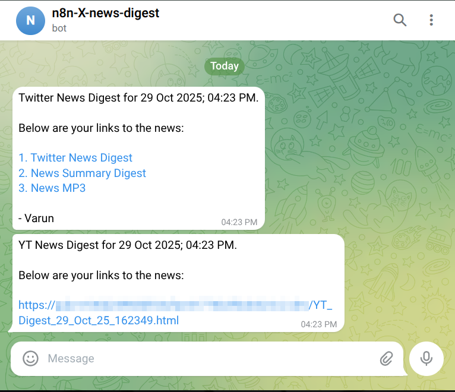

# **n8n Workflow - Twitter, YouTube News Digest**



A n8n workflow that creates a news digest from your favorite X Users and YouTube Channels.

You just have to input the X usernames and YouTube URLs. And this workflow will create an HTML and a radio-braodcast style MP3 and send it to your Telegram.

- **[Click here to download the n8n workflow JSON](n8n-Workflow-X-YT-News-Digest.json)**

## **🧐 The Problem This Solves (Why I Built This)**

I created this workflow to solve a common problem: getting distracted by social media algorithms.

When I wanted to quickly check the latest news from a few trusted journalists on X (Twitter), I would inevitably get pulled into the platform. Reading comments, seeing suggested posts, or clicking on tempting images meant a 5-10 minute news check often resulted in wasting 45 minutes to an hour.

The goal was simple: **Extract the important news from specific sources and consume it in a clean, distraction-free format.**

## **💡 Key Features & User Benefits**

This tool gives you complete control over your news consumption:

- **Major Time Savings:** Reduces your daily news reading time from 45 minutes of platform scrolling to a focused, distraction-free session of **just 5-10 minutes**.

- **Complete Customization:** You can easily add any number of X (Twitter) usernames and YouTube video URLs to the workflow.
- **Multi-Format Output:** Generates four outputs: three HTML digests — a comprehensive tweet roundup, a shorter news summary, and a YouTube news overview. Plus an MP3 audio file styled as a radio news broadcast.
- **AI Synthesis & Summarization:** The workflow uses AI to group related topics from different journalists and creates short summaries of long articles or video transcripts.
- **Delivered on Telegram:** All final digests are delivered directly to your Telegram bot. You never have to log into X or YouTube to get your daily update.

---

### **⚙️ How the Workflow Works**

This workflow processes X/Twitter content first, then YouTube content, generating multiple digest files along the way before sending the final notifications.

```
+------------------------------------------+
|      [ INPUT: X Usernames & YT URLs ]    |
+------------------------------------------+
                   |
                   v
============================================
|        PART 1: X/TWITTER PROCESSING        |
============================================
                   |
                   v
      [ 1. Scrape & Process All Tweets ]
                   |
      (AI Summarizes any long tweets)
                   |
                   v
    +------------------------------------+
    |      [ All Tweet Data Aggregated ] |
    +------------------------------------+
                   |
+------------------+-------------------+------------------+
|                  |                   |                  |
v                  v                   v                  v
[ Generate... ]    [ AI Synthesize... ]  [ AI Create... ]   (Proceed to Part 2)
|                  |                   |
v                  v                   v
[ Raw Tweets ]     [ News Digest ]     [ Audio Script ]
|                  |                   |
v                  v                   v
+----------------+ +-----------------+ [ Generate MP3 ]
| Tweets_...html | | News_...html    | |
+----------------+ +-----------------+ v
                                     +--------------+
                                     | MP3_...mp3   |
                                     +--------------+
                                     |
                                     v
                                     [ Upload & Send Twitter Digest Links via Telegram ]

============================================
|         PART 2: YOUTUBE PROCESSING         |
============================================
                   |
                   v
[ 1. Scrape Video Transcripts ]
                   |
                   v
[ 2. AI Summarize Transcripts ]
                   |
                   v
[ 3. Generate YouTube Digest ]
                   |
                   v
          +-------------------+
          |  YT_Digest.html   |
          +-------------------+
                   |
                   v
          [ Upload & Send YouTube Digest Link via Telegram ]
```

**Part 1: X/Twitter Processing:** The workflow scrapes all recent tweets from the specified users. It uses **Gemini AI** to summarize long posts, then aggregates all the data.

Then, it generates three parallel outputs: the `Raw Tweets Digest`, the AI-synthesized `Structured News Digest`, and the `MP3 Audio Broadcast` (created using FAL AI).

**Part 2: YouTube Processing:** After the Twitter digest is handled, the workflow scrapes transcripts for the provided video URLs. **Gemini AI** creates a detailed summary for each one, which is then formatted into the final `YouTube Summary Digest`.

**Delivery:** Once the files are ready, they are uploaded to **Cloudflare R2** and the links are sent via separate **Telegram Bot** messages.

---

### **📦 The Final Output (What You Get)**



You will receive a Telegram message with links to four files:

- **Link 1 - [Raw Tweets Digest](https://varunsharma.b-cdn.net/projects/n8n-workflow/Tweets_Digest_29_Oct_25_162057.html)**
- **Link 2 - [News Digest](https://varunsharma.b-cdn.net/projects/n8n-workflow/News_Digest_29_Oct_25_162057.html)**
- **Link 3 - [News MP3](https://varunsharma.b-cdn.net/projects/n8n-workflow/MP3_News_Digest_29_Oct_25_162057.mp3)**
- **Link 4 - [YouTube News Digest](https://varunsharma.b-cdn.net/projects/n8n-workflow/YT_Digest_29_Oct_25_162349.html)**

1.  **Raw Tweets Digest HTML:** An HTML page of all collected tweets, grouped by user. Includes an AI summary toggle and links back to the original posts.

2.  **News Digest HTML:** A condensed HTML news report that groups related stories from multiple journalists into single items for fast reading.

3.  **News Broadcast MP3:** A 5-10 minute MP3 audio version of the Structured News Digest, perfect for listening on the go.

4.  **YouTube News Digest HTML:** An HTML page with detailed AI summaries of the provided YouTube videos, preserving the speaker's key points.

---

### **🚀 Getting Started (How to Use)**

#### **Download the workflow here: \[PLACEHOLDER: Link to n8n-Workflow-X-YT-News-Digest.json]**

1.  **Prerequisites:** You will need an n8n instance (Desktop or Cloud) and accounts for the services listed below.
2.  **Import Workflow:** Download the JSON file and import it into your n8n instance.
3.  **Configure Credentials:** Update the credentials for all the service nodes (Apify, Gemini, FAL AI, Cloudflare R2, Telegram) with your own API keys.
4.  **Customize Sources:** Open the **`Add Videos & X Usernames`** node (Step 0) and edit the JSON to include the X usernames and YouTube video URLs you want to monitor.
5.  **Execute:** Click the "Execute workflow" button. After a few minutes, you will receive a message with all the digest links in your configured Telegram chat.

### **🔑 Required Services & API Keys**

To run this workflow, you will need API credentials for the following services:

| Service                          | Node Name in Workflow                            | Purpose                                                          |
| :------------------------------- | :----------------------------------------------- | :--------------------------------------------------------------- |
| **Apify**                        | `Initiate Tweet Scraping`, `Initiate YT Scraper` | To scrape the latest tweets and video transcripts.               |
| **Google Gemini**                | All nodes named `Gemini Flash 2.5`               | Powers all AI summarization, synthesis, and scriptwriting tasks. |
| **FAL AI**                       | `FAL POST Request`                               | Generates the high-quality MP3 audio from the news script.       |
| **Cloudflare R2** (or Amazon S3) | All `Upload... to R2` nodes                      | Hosts the final HTML and MP3 files for easy access.              |
| **Telegram Bot**                 | `Send News Links on Telegram`                    | For delivering the final links to your phone or desktop.         |
